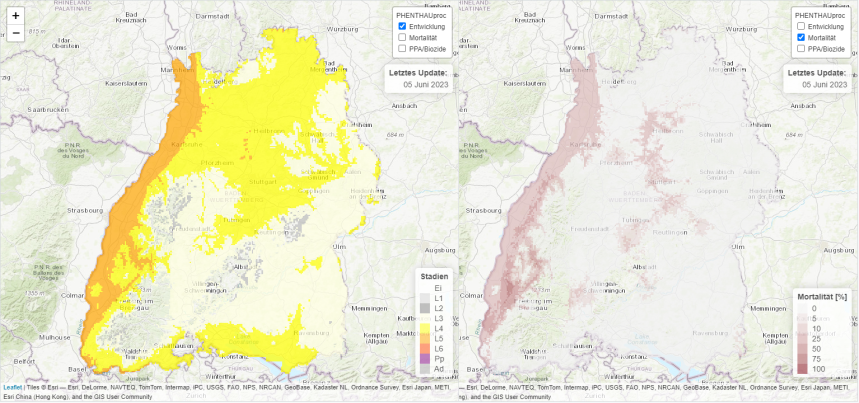

```{r, include = FALSE}
knitr::opts_chunk$set(
  collapse = TRUE,
  comment = "#>"
)
```

PHENTHAUproc is an early warning system, modelling the life cycle of oak processionary moth (OPM, *Thaumetopoea processionea*) with temperature data. It was created by Halbig et al. 2024[^1] at [FVA – Forest Research Institute Baden-Wuerttemberg](https://www.fva-bw.de/en/), Germany and Institute Baden-Wuerttemberg, Germany and [BOKU](https://boku.ac.at/en/) - University of Natural Resources and Life Sciences, Vienna, Austria.

The aim is to support practitioners in risk assessment and planning of measures. It consists of temperature-sum based models to predict the phenological development of OPM stages, bud swelling and leaf unfolding of oak (*Quercus robur*), the starvation-dependent mortality of OPM L1 larvae as well as the application period of possible plant protection agents (ppa) and biocides.

This package implements the phenological models of PHENTHAUproc in R for local weather station data and spatial data, using the [terra](https://CRAN.R-project.org/package=terra/) package created by Robert J. Hijmans.

The models were developed, adjusted and tested using temperature data and OPM observation data from Brandenburg and Baden-Wuerttemberg, Germany. Consider this in calculating OPM development in other regions.


## Installation & setup

PHENTHAUproc is available on CRAN.

```{r, echo = T, message = F, warning = F}
library(PHENTHAUproc)

# Packages used for demonstration:
library(terra)
library(tidyterra)
library(ggplot2)
library(geomtextpath)
library(grDevices)
```

## Required data structure

PHENTHAUproc works with temperature-sum based models. The calculation requires daily mean, min and max air temperature in Celsius. For local prognosis, a data frame with the columns date, hour and tmean is required. For regional calculations, a named list of SpatRasters with equal time attribute is needed. The names of the list objects have to be tmean, tmin and tmax. The last available year will be used as year of prediction. Be aware that some models require temperature data from the previous year (Default: 1. Sept from previous year).

Weather station data and raster data for Germany can be found at [Climate Data Center](https://opendata.dwd.de/) of DWD (German Meteorological Service), the basis of our sample record. In our regional example, we use a 4*4 pixel cutout centered at FVA from the spatial data of the DWD dataset ["HYRAS"](https://opendata.dwd.de/climate_environment/CDC/grids_germany/daily/hyras_de/air_temperature_mean/).

Spatial resolution: 5 km x 5 km   
Projection: ETRS89 / LCC Europe (EPSG:3034)   
Parameter: mean min and max air temperature at 2 m    
time: from 2019-09-01 to 2020-09-30   

For local data, we use hourly temperature data in Celsius from the weather station of Freiburg im Breisgau(Stations_id: 01443) from 2019 to 2022. (You can use ?load_test() to load example datasets.)

```{r, echo = T, message = F}
# local data for PHENTHAUproc 
freiburg <- load_test("hour")

head(freiburg)
```


```{r, echo = T, message = F}
# spatial data for PHENTHAUproc
fva <-  load_test("SpatRaster")
fva
```

## PHENTHAUproc

### Calculation

With the phenthau function, all model predictions are calculated. For a data frame input, it will return a data frame with the computed start dates of the phenological events (like bud swelling, different larval stages, etc.) or % for OPM L1 larval mortality. For a SpatRasterlist input, phenthau returns a SpatRasterlist. The output will always be limited from 1. February to 30. September. For more output information see: ?phenthau

```{r, echo = T, message = F}
# phenthau chooses parameter sets dependent on the input
local <- phenthau(freiburg)
regional <- phenthau(fva)

# we can also preset the parameters.
params <- parameter("dailymeanminmax", year = 2020) # returns parameter set for daily mean min max temperatures

# and change them
params$budswelling$ldt <- 5 # change lower development threshold for budswelling from Default to 5
regional_manipulated <- phenthau(fva, params = params)

rm(params, regional_manipulated)
```

### Results

#### Oak phenology
For oak phenology, bud swelling and leaf unfolding are calculated based on the work of Menzel 1997[^2]. Bud swelling determines the feeding start of hatched OPM L1 larvae. Leaf unfolding sets the start of the possible ppa/biocide usage. Leaf unfolding can be calculated for Quercus robur with different parametrisations related to the oak clones from which phenology observation data for model creation were obtained.

#### L1 - hatch
Hatch of OPM defines the beginning of the first larval stage L1. PHENTHAUproc includes three hatch models.

- Custers 2003[^3]  
- Meurisse et al. 2012[^4]  
- Wagenhoff et al. 2014[^5]

#### OPM - stages
Hatch and bud swelling are starting the feeding period of OPM and the calculation of the further development stages:  

- L2-L6 larval stages  
- Pp Pupa  
- Ad Adult  

#### Ppa/biocide application period
The application period of appropriate ppa/biocides starts with leaf unfolding of oak and ends with the beginning of larval stage (L4) of OPM.

#### Mortality
The starvation-related mortality is calculated. It depends on the temperature sum during the period from OPM L1 hatching to oak bud swelling. Lacking coincidence of these two phenological events can lead to mortality of the young larvae (Wagenhoff et al. 2013[^6], Halbig et al. 2024).


## Presentation of local PHENTHAUproc

Two graphs (currently only in English language) are available for local results and require ggplot2 and geomtextpath as additional packages. 

```{r, echo = T, out.width = "100%", fig.dim = c(8, 6), message = T}
plot_station_step(local)
plot_station(local, main = "PHENTHAUproc\nFreiburg")
```


## Presentation of regional PHENTHAUproc

### Stages

Stages is a SpatRaster with one layer per day and values from 0 to 8 for each development stage of OPM rom the egg stage to the adult stage (see phenthau_legend() for assignment). The plot_stages function is a wrapper around terra::plot to preset categories and colors and subset the required date (Default: max(date)).

```{r, echo = T, out.width = "50%", fig.align = "center", fig.cap = "OPM larval stages 5. June 2020", message = F}
stages <- regional$stages

plot_stages(stages,
            time = "2020-06-05",
            main = "OPM larval stages - 5. June 2020",
            axes = F,
            box = T)
```

### Mortality

To assign colors and categories directly to the SpatRaster or to use it elsewhere, you can use the get_legend function.

```{r, echo = T, out.width = "50%", fig.cap = "Starvation related Mortality 2020" ,fig.align = "center", message = T}
# return mortality from list
mort <- regional$mortality

# get_legend returns a dataframe with ID, category and colors for a spatial PHENTHAUproc output
legend <- get_legend("mortality")

# set levels and colors for mortality
levels(mort) <- legend[,c("ID", "category")]
terra::coltab(mort) <- legend[,c("ID", "colors")]

# plot mortality FVA 2020
terra::plot(mort,
            plg = list(title = "%"),
            main = "Mortality 2020",
            all_levels = T,
            axes = F,
            box = T)
```

## Examples

### Example: Phenology of Quercus robur at Freiburg (FVA) in 2020

Single phenological models can be calculated with the phenology function using different parametrisations (see parameter() for all preset parameters). Single parameter can directly be manipulated to compare phenological models.

```{r, echo = T, message = F, warning = F}
# show possible models and parametrisation: parameter()
leafunfolding <- phenology(fva,
                           model = "leafunfolding",
                           parametrisation = "quercus_robur_clone256_type1")

```


```{r, echo = F, out.width = "100%", fig.dim = c(8, 6), fig.align = "center", message = F, warning = F}

mi <- min(terra::minmax(leafunfolding)["min",])
ma <- max(terra::minmax(leafunfolding)["max",])
me <- round(mean(c(mi, ma)))

ggplot() +
  geom_spatraster(data = leafunfolding) +
  scale_fill_whitebox_c(
    palette = "gn_yl",
    labels = lubridate::as_date,
    breaks = c(mi, me, ma),
    guide = guide_colorbar(
      title.position = "top",
      ticks.colour = "white",
      ticks.linewidth = 0.3
    )
  ) +
  theme_bw() +
  labs(title = "Leafunfolding 2020", subtitle = "4*4 pixel cutout centered at FVA", fill = "leafunfolding") +
  theme(legend.position = "right")
```

### Example: Hatch at Freiburg (FVA) in 2020

```{r, echo = T, message = F, warning = F}
custers <- phenology(fva, model = "hatch", parametrisation = "custers")
meurisse <- phenology(fva, model = "hatch", parametrisation = "meurisse")
wagenhoff <- phenology(fva, model = "hatch", parametrisation = "wagenhoff")
```

```{r, echo = F, out.width = "100%", fig.dim = c(8, 6), fig.align = "center", message = F, warning = F}
hatch <- c(custers, meurisse, wagenhoff)
names(hatch) <- c("custers", "meurisse", "wagenhoff")

mi <- min(terra::minmax(hatch)["min",])
ma <- max(terra::minmax(hatch)["max",])
me <- round(mean(c(mi, ma)))

ggplot() +
  geom_spatraster(data = hatch) +
  facet_wrap(~lyr, ncol = 3) +
  scale_fill_whitebox_c(
    palette = rev("viridi"),
    direction = -1,
    labels = lubridate::as_date,
    breaks = c(mi, me, ma),
    guide = guide_colorbar(
      direction = "horizontal",
      title.position = "top",
      barwidth = 20,
      draw.ulim = 1,
      draw.llim = 1
    )
  ) +
  theme_bw() +
  labs(title = "Hatchmodels 2020",
       subtitle = "4*4 pixel cutout centered at FVA",
       fill = "hatchday") +
  theme(legend.position = "bottom",
        axis.text.x = element_blank(),
        axis.text.y = element_blank())

```

### Example: Implementation with [leaflet](https://leafletjs.com/)




[^1]: Halbig, P., Stelzer, A., Baier, P., Pennerstorfer, J., Delb, H., Schopf, A. 2023 PHENTHAUproc – An early warning and decision support system for hazard assessment and control of oak processionary moth (Thaumetopoea processionea) [doi](doi:10.1016/j.foreco.2023.121525)   
[^2]: Menzel, A. 1997 Phänologie von Waldbäumen unter sich ändernden Klimabedingungen - Auswertung der Beobachtungen in den Internationalen Phänologischen Gärten und Möglichkeiten der Modellierung von Phänodaten. Forstliche Forschungsberichte München, 164, 1-147.  
[^3]: Custers, C.J.L. 2003 Climate change and trophic synchronisation - A casestudy of the Oak Processionary Caterpillar. Master's Thesis, Wageningen University.  
[^4]: Meurisse, N., Hoch, G., Schopf, A., Battisti, A. and Grégoire, J.C. 2012 Low temperature tolerance and starvation ability of the oak processionary moth: implications in a context of increasing epidemics. Agricultural and Forest Entomology, 14, 239-250. [doi](doi:10.1111/j.1461-9563.2011.00562.x)  
[^5]: Wagenhoff, E., Wagenhoff, A., Blum, R., Veit, H., Zapf, D. and Delb, H. 2014 Does the prediction of the time of egg hatch of Thaumetopoea processionea (Lepidoptera: Notodontidae) using a frost day/temperature sum model provide evidence of an increasing temporal mismatch between the time of egg hatch and that of budburst of Quercus robur due to recent global warming? European Journal of Entomology, 111, 207-215. [doi](doi:10.14411/eje.2014.030)   
[^6]: Wagenhoff, E., Blum, R., Engel, K., Veit, H., Delb, H., 2013. Temporal synchrony of Thaumetopoea processionea egg hatch and Quercus robur budburst. J. Pest. Sci. 86, 193–202. [doi](<doi:10.1007/s10340-012-0457-7>)

\documentclass{article}


